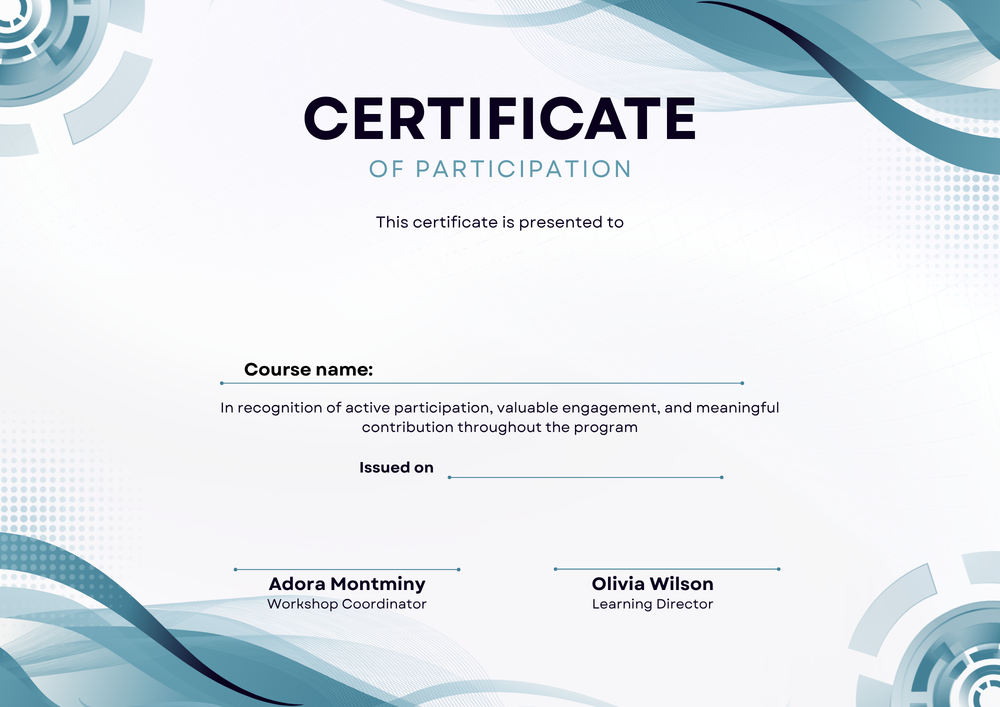
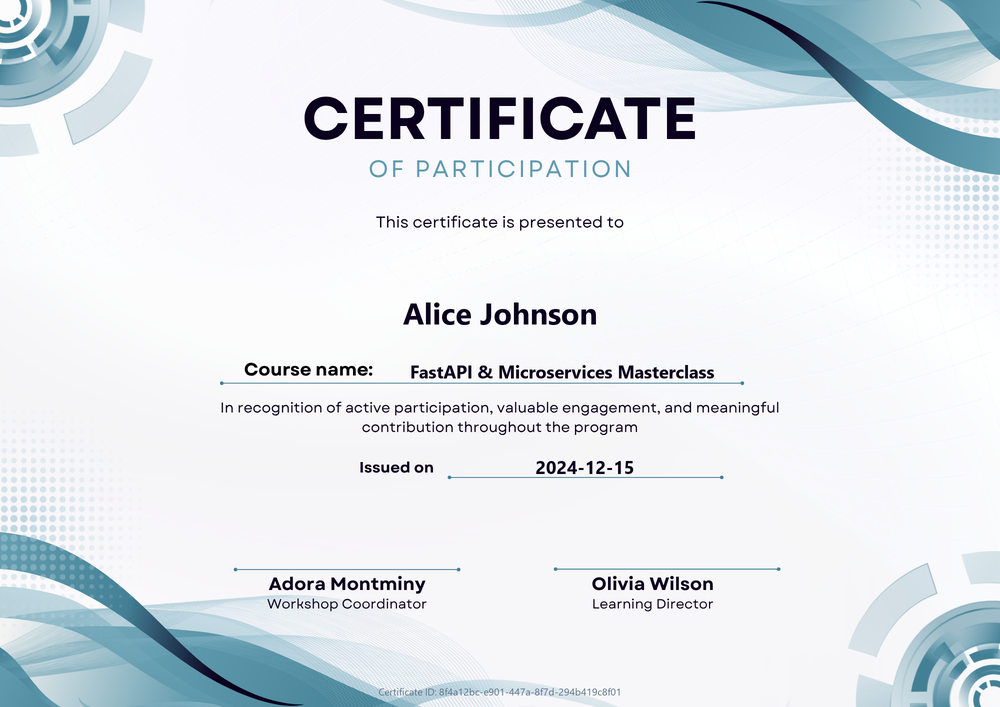
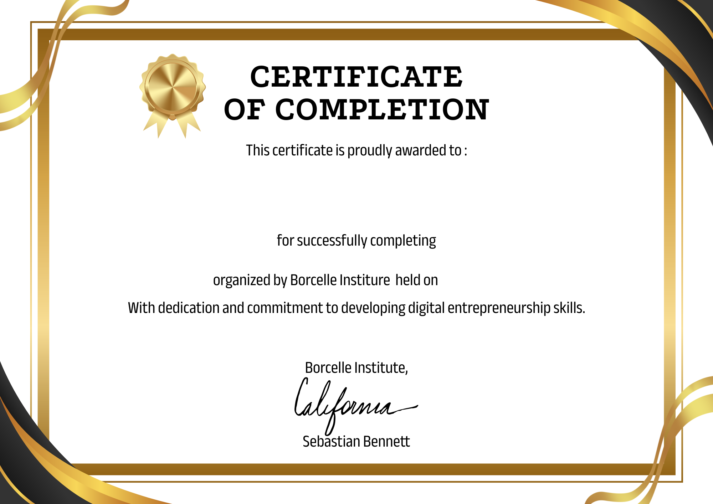
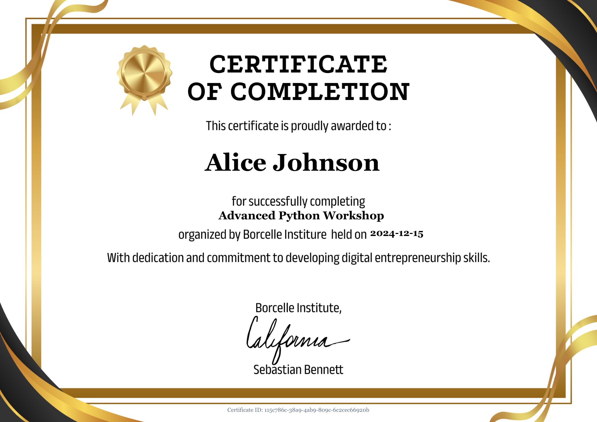
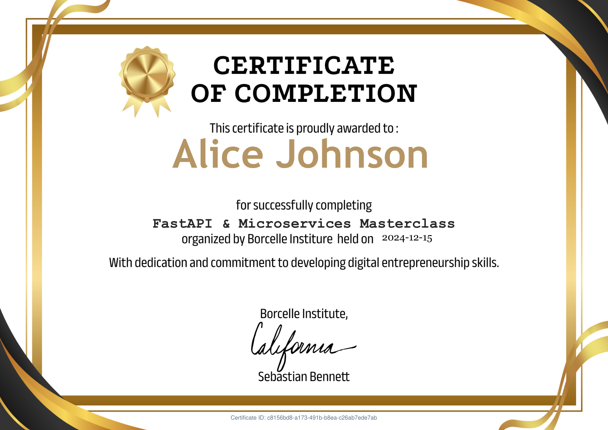
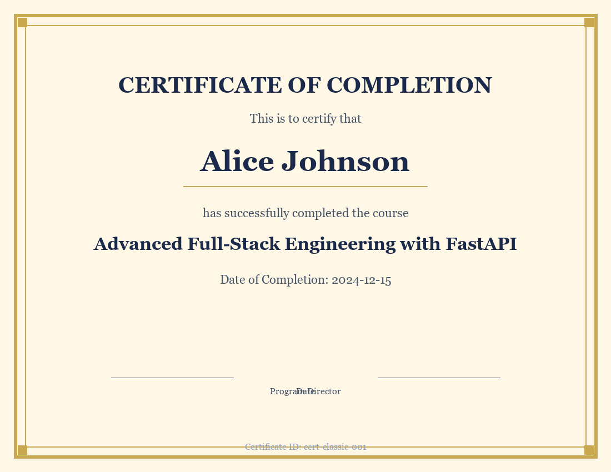
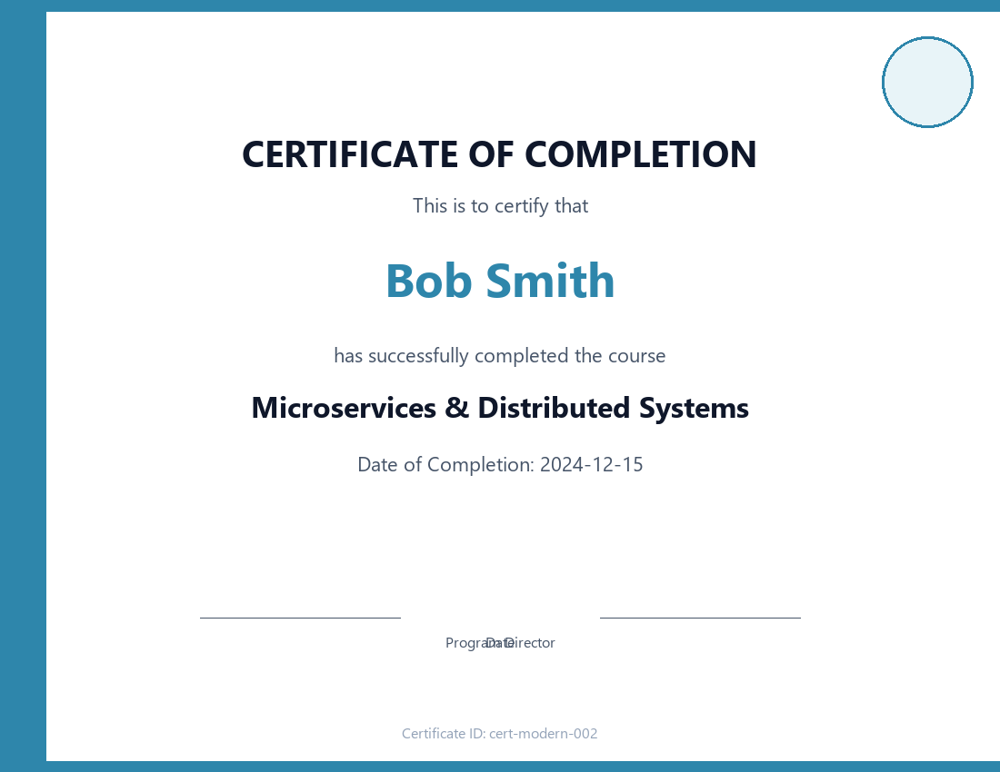

# Bulk Certificate Generator

A high-performance FastAPI service to generate PDF certificates in bulk with custom and built-in templates.

## Features

- **Bulk Generation**: Process up to 10,000 certificates in a single batch
- **Custom Template Uploads**: Upload PNG, JPEG, or PDF templates as backgrounds
- **Precision Text Alignment**: Automatic placement and baseline alignment above underlines
- **Typography & Color Matching**: Adapts fonts and text colors to the template aesthetic
- **Dynamic Text Scaling**: Auto-scales text sizes to prevent overflow
- **Asynchronous Processing**: Non-blocking background generation
- **Progress Tracking**: Real-time job status and success/failure counters
- **Failure Isolation**: Errors on one certificate do not halt the rest of the batch
- **Flexible Downloads**: Download individual PDFs or all certificates in a ZIP archive
- **Interactive UI & Docs**: Built-in web dashboard and Swagger UI (`/docs`)

## Feature Status & Roadmap

- $\color{#0969da}{\mathbf{\checkmark}}$ **1. Upload Custom Template**: Upload user-designed backgrounds in PNG, JPEG, or PDF formats
- $\color{#0969da}{\mathbf{\checkmark}}$ **2. Individual & Bulk Downloads**: Download single certificates as PDF or all certificates as a ZIP archive
- $\color{#0969da}{\mathbf{\checkmark}}$ **3. Excel / CSV File Upload**: Upload Excel spreadsheets (.xlsx) or CSV files to generate certificates in bulk
- $\color{#0969da}{\mathbf{\checkmark}}$ **4. Font, Size & Color Selection**: Select from 10 distinct fonts, adjust font size with sliders, and pick colors using native color pickers independently for Recipient Name, Course, and Date
- $\color{#0969da}{\mathbf{\checkmark}}$ **5. Live Certificate Preview**: Real-time canvas preview of font style, size, color, and positions synchronized over WebSocket and saved to template settings

## Tech Stack

| Component | Technology |
|-----------|------------|
| Framework | FastAPI |
| Database | SQLite + SQLAlchemy |
| PDF Generation | ReportLab |
| Validation | Pydantic |
| Background Processing | FastAPI BackgroundTasks |

## Visual Showcase

### Custom Template Support
Demonstrating custom template input vs. pixel-perfect generated certificate output:

| Custom Template Input | Generated Certificate Output |
|:---:|:---:|
|  |  |

### Custom Position Alignment (Live WebSocket Positioner)
Demonstrating real-time coordinate calibration where recipient name, course title, and date are dynamically positioned over a custom template:

| Custom Template Input | Custom Position Aligned Output |
|:---:|:---:|
|  |  |

*PDF Vector File*: [`outputs/template_new_custom_position.pdf`](outputs/template_new_custom_position.pdf)

### Custom Font Size, Typography & Color Selection
Demonstrating independent field typography, custom font size scaling, and color matching (e.g. customized recipient font size & gold tone, course in Courier monospace):

| Custom Template Input | Custom Font Size & Styling Output |
|:---:|:---:|
|  |  |

*PDF Vector File*: [`outputs/template_2_custom_font_size.pdf`](outputs/template_2_custom_font_size.pdf)

### Built-in Templates
Results across the 3 built-in styles:

| Classic Style | Modern Style | Elegant Style |
|:---:|:---:|:---:|
|  |  |  |

---

## How to Set Up the Project

### Prerequisites

- Python 3.10+ or Docker
- `uv` (recommended), `pip`, or Docker Desktop

### Local Installation

Using `uv` (recommended):
```bash
# Clone or navigate to the project directory
cd "Bulk certificate gnerator"

# Create and activate virtual environment
uv venv
.venv\Scripts\activate      # Windows (.venv/bin/activate on macOS/Linux)

# Install dependencies
uv pip install -r requirements.txt
```

*(Or using standard pip: `python -m venv venv && venv\Scripts\activate && pip install -r requirements.txt`)*

---

## How to Run the Application

### Option 1: Docker (Recommended)

Run with Docker Compose:
```bash
docker compose up --build
```

Or run with Docker CLI:
```bash
docker build -t certificate-generator .
docker run -d -p 8000:8000 -v ${PWD}/certificates.db:/app/certificates.db --name cert-generator certificate-generator
```

### Option 2: Local Python

```bash
uvicorn app.main:app --reload
```

Access the application:
- **Interactive Web UI**: http://localhost:8000/
- **Interactive API Docs (Swagger)**: http://localhost:8000/docs
- **Alternative Docs (ReDoc)**: http://localhost:8000/redoc

---

## How to Run Tests

Run the complete test suite with pytest:

```bash
pytest tests/ -v
```

---

## API Endpoints

| Method | Endpoint | Description |
|--------|----------|-------------|
| `POST` | `/api/v1/jobs` | Submit a bulk certificate generation request |
| `POST` | `/api/v1/jobs/upload-sheet` | Submit batch generation directly from Excel/CSV file |
| `POST` | `/api/v1/recipients/parse-file` | Parse and validate recipients from Excel/CSV file |
| `GET` | `/api/v1/jobs` | List all jobs (paginated) |
| `GET` | `/api/v1/jobs/{job_id}` | Get job status and certificate details |
| `GET` | `/api/v1/jobs/{job_id}/certificates` | List certificates for a job |
| `GET` | `/api/v1/certificates/{id}/download` | Download a single certificate PDF |
| `GET` | `/api/v1/jobs/{job_id}/download-all` | Download all certificates as ZIP |
| `GET` | `/api/v1/templates` | List available templates |
| `POST` | `/api/v1/templates/upload` | Upload a custom template |
| `PUT` | `/api/v1/templates/{id}/layout` | Save coordinates, font styles, sizes, and colors for a template |
| `GET` | `/api/v1/templates/{id}/background` | Fetch template background image for live canvas preview |
| `WS` | `/api/v1/ws/preview` | Real-time WebSocket connection for live positioning and style sync |
| `DELETE`| `/api/v1/templates/{id}` | Delete a custom template |
| `DELETE`| `/api/v1/templates/custom/clear-all` | Clear all custom templates |

---

## How to Submit a Certificate Generation Request

### Using curl

```bash
curl -X POST http://localhost:8000/api/v1/jobs \
  -H "Content-Type: application/json" \
  -d '{
    "recipients": [
      {
        "name": "Alice Johnson",
        "email": "alice@example.com",
        "course_name": "Advanced Python Workshop",
        "date": "2024-12-15"
      },
      {
        "name": "Bob Smith",
        "course_name": "Advanced Python Workshop",
        "date": "2024-12-15"
      }
    ],
    "template_id": "modern"
  }'
```

### Using Python (httpx)

```python
import httpx

response = httpx.post(
    "http://localhost:8000/api/v1/jobs",
    json={
        "recipients": [
            {
                "name": "Alice Johnson",
                "email": "alice@example.com",
                "course_name": "Advanced Python Workshop",
                "date": "2024-12-15",
            }
        ],
        "template_id": "classic",
    },
)
print(response.json())
```

### Checking Job Status

```bash
curl http://localhost:8000/api/v1/jobs/{job_id}
```

Example response:
```json
{
  "id": "e4b6c374-12a4-4f81-a1cf-b07a51c91db6",
  "status": "completed",
  "template_id": "modern",
  "total_recipients": 2,
  "successful_count": 2,
  "failed_count": 0,
  "created_at": "2024-12-15T10:30:00",
  "completed_at": "2024-12-15T10:30:04",
  "certificates": [
    {
      "id": "c1f74992-d61b-4228-a5ec-91fc4f9e15ad",
      "recipient_name": "Alice Johnson",
      "status": "success",
      "download_url": "/api/v1/certificates/c1f74992-d61b-4228-a5ec-91fc4f9e15ad/download"
    }
  ]
}
```

---

## How to Retrieve Generated Certificates

### Single Certificate (PDF)
```bash
curl -O http://localhost:8000/api/v1/certificates/{certificate_id}/download
```

### Bulk Certificates (ZIP Archive)
```bash
curl -O http://localhost:8000/api/v1/jobs/{job_id}/download-all
```

---

## Design Decisions

### Why Background Processing?

Certificate generation is CPU-bound (PDF rendering). Processing synchronously would block the API for large batches. `BackgroundTasks` keeps the API responsive while certificates are generated.

**Why not Celery?** Celery requires Redis or RabbitMQ as a broker — additional infrastructure that's overkill for this scope. FastAPI's `BackgroundTasks` is built-in and works well for single-server deployments. Migrating to Celery later only requires changing the task dispatch — the API contract stays the same.

### Why SQLite?

Meets the "relational database" requirement with zero setup. SQLAlchemy's ORM makes the database layer swappable — change the `DATABASE_URL` to PostgreSQL and everything works.

### Why ReportLab?

ReportLab generates PDFs natively in Python without external system dependencies (no wkhtmltopdf, no LaTeX). The built-in templates are pure Python drawing functions, so the app runs anywhere Python runs.

### Failure Isolation

Each certificate is generated inside its own `try/except` block. A failure on one certificate (e.g., a corrupt template image) records the error and continues processing the remaining certificates. The job still completes — the status response shows exactly which certificates succeeded and which failed.

---

## Project Structure

```
.
├── Dockerfile                   # Multi-stage container build
├── docker-compose.yml           # Docker deployment configuration
├── requirements.txt             # Pinned project dependencies
├── README.md                    # Reviewer documentation
├── USER.md                      # Architecture walkthrough & interview guide
├── app/
│   ├── main.py                  # FastAPI application entry point
│   ├── config.py                # Environment & application settings
│   ├── database.py              # Database connection & session setup
│   ├── models.py                # SQLAlchemy ORM models
│   ├── schemas.py               # Pydantic request/response validation schemas
│   ├── static/
│   │   └── index.html           # Web UI dashboard
│   ├── routers/
│   │   └── jobs.py              # API routes (/jobs, /certificates, /templates)
│   └── services/
│       ├── job_service.py       # Batch job management & async processing
│       ├── certificate_generator.py # ReportLab PDF rendering engine
│       └── sheet_parser.py      # Excel (.xlsx) and CSV spreadsheet ingestion
├── outputs/                     # Visual results & template previews
└── tests/                       # Complete pytest suite (55 passing tests)
```
